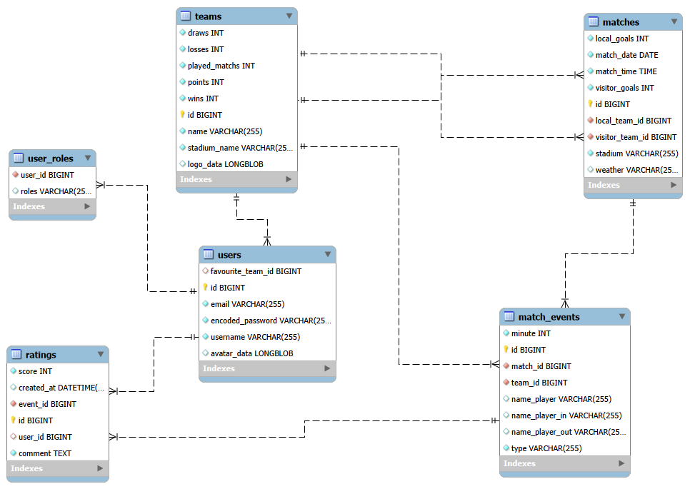

# [Nombre de la Aplicación]

## 👥 Miembros del Equipo
| Nombre y Apellidos | Correo URJC | Usuario GitHub |
|:--- |:--- |:--- |
| Jaime Tejero Fernández | j.tejero.2024@alumnos.urjc.es | Jaime2006cib |
| Rubén Sánchez López | r.sanchezl.2024@alumnos.urjc.es | ruben2393 |
| Sergio Sánchez López | s.sanchezl.2024@alumnos.urjc.es | xxSerbotXX04 |
| [Nombre 4] | [email4]@alumnos.urjc.es | [User4] |

---

## 🎭 **Preparación: Definición del Proyecto**

### **Descripción del Tema**
La aplicación tendrá como objetivo principal funcionar como una plataforma web de visualización y seguimiento de resultados de partidos de fútbol.
Inicialmente está app estará diseñada para una (como mucho 2) Ligas/Torneos en el cual representaremos a cada equipo con un Nombre (por ejemplo, Parla FC) y un Estandarte/Escudo asociado. El usuario podrá consultar los resultados por jornada, las alineaciones, las plantillas completas (jugadores y cuerpo técnico) y los detalles de cada partido disputado. Además se incluirá la capacidad del usuario de hacer login y elegir su equipo favorito (para no perderse las últimas novedades de este), de poder reseñar a jugadores en cada jornada (siempre y cuando tengan un usuario) y la capacidad de ver que ocurrió en el partido X de su equipo favorito (resultado, formacion inicial, Temporal, Campo en el que se jugó, Goles con el minuto en que se marcó y el dorsal y nombre el jugador goleador asociado, Tarjetas (Rojas o amarillas) con un formato similar al de los goles). Por último incluiremos varias funcionalidades extra como un panel de Novedades (donde podremos mostrar algunas novedades importantes de la Liga/Torneo como expulsiones, cesiones, incorporaciones etc) así como una tabla de clasificación dinámica que mostrará la posición de cada equipo, su escudo, puntos obtenidos, partidos ganados, empatados y perdidos, además de la diferencia de goles y una tabla de máximos goleadores. 
Está aplicación estará diseñada con la finalidad de ayudar a aficionados, entrenadores, árbitros, jugadores etc a poder ver los resultados de su Liga preferida y tener un mejor control de los resultados de está y poder así seguir a su equipo favorito pudiendo estar informados de las últimas noticias de este.

### **Entidades**
Indicar las entidades principales que gestionará la aplicación y las relaciones entre ellas:

1. **[Entidad 1]**  Usuario: Almacena el perfil (email, contraseña), el Rol que desempeña (entrenador, jugador, árbitro, aficionado etc) y la preferencia del Equipo Favorito.
2. **[Entidad 2]**: Equipo: Información del club (Nombre, Escudo, Estadio) y sus estadísticas acumuladas (puntos, goles).
3. **[Entidad 3]**: Jugador / Cuerpo Técnico: Ficha técnica de los integrantes (Nombre, Dorsal, Posición, Equipo al que pertenecen).
4. **[Entidad 4]**: Partido: El evento central que une a dos equipos, con fecha, jornada, marcador final y campo, además incluiremos la funcionalidad de reseñar partidos en donde los usuarios logueados podrán dar puntuaciones a los Jugadores en un partido X así como incluir reseñas escritas de cada jugador para ese partido.
5. **[Entidad 5]**: Evento de Partido: Registro de cada hito (Gol, Tarjeta Roja/Amarilla, Cambio) vinculado a un minuto y a un jugador.
6. **[Entidad 6]**: Noticia / Novedad: Entradas de texto e imagen para el panel de novedades (fichajes, sanciones).  

**Relaciones entre entidades:**
- Usuario - Equipo (N:1): Muchos usuarios pueden tener el mismo "Equipo Favorito".
- Jugador - Evento (1:N): Un jugador puede marcar varios goles o recibir tarjetas en diferentes partidos.
- Jugador - Usuario (1:N): Un jugador puede tener varias reseñas de muchos Usuarios.
- Partido - Evento (1:N): Un solo partido puede generar múltiples eventos (ej: 3 goles y 2 tarjetas).
- Equipo - Partido (1:N): Un equipo participa en muchos partidos a lo largo del torneo (ya sea como local o visitante).
- Equipo - Jugador (1:N): Un equipo tiene muchos jugadores, pero un jugador (en el momento actual de la liga) solo pertenece a un equipo.

### **Permisos de los Usuarios**
Describir los permisos de cada tipo de usuario e indicar de qué entidades es dueño:

* **Usuario Anónimo**: 
  - Permisos:
      - Visualizar resultados, partidos y clasificaciones
      - Consultar equipos, jugadores y estadísticas
      - Acceder al panel de novedades
      - Registrarse en la aplicación
  - No es dueño de ninguna entidad

* **Usuario Registrado**: 
  - Permisos:
      - Todas las funcionalidades del usuario anónimo
      - Gestión de su perfil y selección de equipo favorito
      - Valorar jugadores en partidos
      - Escribir reseñas asociadas a partidos
  - Es dueño de:
      - Su perfil de usuario
      - Sus valoraciones y reseñas

* **Administrador**: 
  - Permisos:
      - Gestión completa (CRUD) de equipos, jugadores y cuerpo técnico
      - Creación y edición de partidos y eventos
      - Publicación y moderación de noticias
      - Gestión de usuarios
  - Es dueño de:
      - Todas las entidades del sistema

### **Imágenes**
Indicar qué entidades tendrán asociadas una o varias imágenes:

- **[Entidad con imágenes 1]**: [Ej: Usuario - Una imagen de avatar por usuario]
- **[Entidad con imágenes 2]**: [Ej: Producto - Múltiples imágenes por producto (galería)]
- **[Entidad con imágenes 3]**: [Ej: Categoría - Una imagen representativa por categoría]

---

## 🛠 **Práctica 1: Maquetación de páginas con HTML y CSS**

### **Vídeo de Demostración**
📹 **[Enlace al vídeo en YouTube](https://www.youtube.com/watch?v=x91MPoITQ3I)**
> Vídeo mostrando las principales funcionalidades de la aplicación web.

### **Diagrama de Navegación**
Diagrama que muestra cómo se navega entre las diferentes páginas de la aplicación:


> [Descripción opcional del flujo de navegación: Ej: "El usuario puede acceder desde la página principal a todas las secciones mediante el menú de navegación. Los usuarios anónimos solo tienen acceso a las páginas públicas, mientras que los registrados pueden acceder a su perfil y panel de usuario."]

### **Capturas de Pantalla y Descripción de Páginas**

#### **1. Página Principal / Home**


> [Descripción breve: Ej: "Página de inicio que muestra los productos destacados, categorías principales y un banner promocional. Incluye barra de navegación y acceso a registro/login para usuarios no autenticados."]

#### **AQUÍ AÑADIR EL RESTO DE PÁGINAS**

### **Participación de Miembros en la Práctica 1**

#### **Alumno 1 - [Nombre Completo]**

[Descripción de las tareas y responsabilidades principales del alumno en el proyecto]

| Nº    | Commits      | Files      |
|:------------: |:------------:| :------------:|
|1| [Descripción commit 1](URL_commit_1)  | [Archivo1](URL_archivo_1)   |
|2| [Descripción commit 2](URL_commit_2)  | [Archivo2](URL_archivo_2)   |
|3| [Descripción commit 3](URL_commit_3)  | [Archivo3](URL_archivo_3)   |
|4| [Descripción commit 4](URL_commit_4)  | [Archivo4](URL_archivo_4)   |
|5| [Descripción commit 5](URL_commit_5)  | [Archivo5](URL_archivo_5)   |

---

#### **Alumno 2 - [Nombre Completo]**

[Descripción de las tareas y responsabilidades principales del alumno en el proyecto]

| Nº    | Commits      | Files      |
|:------------: |:------------:| :------------:|
|1| [Descripción commit 1](URL_commit_1)  | [Archivo1](URL_archivo_1)   |
|2| [Descripción commit 2](URL_commit_2)  | [Archivo2](URL_archivo_2)   |
|3| [Descripción commit 3](URL_commit_3)  | [Archivo3](URL_archivo_3)   |
|4| [Descripción commit 4](URL_commit_4)  | [Archivo4](URL_archivo_4)   |
|5| [Descripción commit 5](URL_commit_5)  | [Archivo5](URL_archivo_5)   |

---

#### **Alumno 3 - [Nombre Completo]**

[Descripción de las tareas y responsabilidades principales del alumno en el proyecto]

| Nº    | Commits      | Files      |
|:------------: |:------------:| :------------:|
|1| [Descripción commit 1](URL_commit_1)  | [Archivo1](URL_archivo_1)   |
|2| [Descripción commit 2](URL_commit_2)  | [Archivo2](URL_archivo_2)   |
|3| [Descripción commit 3](URL_commit_3)  | [Archivo3](URL_archivo_3)   |
|4| [Descripción commit 4](URL_commit_4)  | [Archivo4](URL_archivo_4)   |
|5| [Descripción commit 5](URL_commit_5)  | [Archivo5](URL_archivo_5)   |

---

#### **Alumno 4 - [Nombre Completo]**

[Descripción de las tareas y responsabilidades principales del alumno en el proyecto]

| Nº    | Commits      | Files      |
|:------------: |:------------:| :------------:|
|1| [Descripción commit 1](URL_commit_1)  | [Archivo1](URL_archivo_1)   |
|2| [Descripción commit 2](URL_commit_2)  | [Archivo2](URL_archivo_2)   |
|3| [Descripción commit 3](URL_commit_3)  | [Archivo3](URL_archivo_3)   |
|4| [Descripción commit 4](URL_commit_4)  | [Archivo4](URL_archivo_4)   |
|5| [Descripción commit 5](URL_commit_5)  | [Archivo5](URL_archivo_5)   |

---

## 🛠 **Práctica 2: Web con HTML generado en servidor**

### **Vídeo de Demostración**
📹 **[Enlace al vídeo en YouTube](https://www.youtube.com/watch?v=x91MPoITQ3I)**
> Vídeo mostrando las principales funcionalidades de la aplicación web.

### **Navegación y Capturas de Pantalla**

#### **Diagrama de Navegación**

Solo si ha cambiado.

#### **Capturas de Pantalla Actualizadas**

Solo si han cambiado.

### **Instrucciones de Ejecución**

#### **Requisitos Previos**
- **Java**: versión 21 o superior
- **Maven**: versión 3.8 o superior
- **MySQL**: versión 8.0 o superior
- **Git**: para clonar el repositorio

#### **Pasos para ejecutar la aplicación**

1. **Clonar el repositorio**
   ```bash
   git clone https://github.com/[usuario]/[nombre-repositorio].git
   cd [nombre-repositorio]
   ```

2. **AQUÍ INDICAR LO SIGUIENTES PASOS**

#### **Credenciales de prueba**
- **Usuario Admin**: usuario: `admin`, contraseña: `admin`
- **Usuario Registrado**: usuario: `user`, contraseña: `user`

### **Diagrama de Entidades de Base de Datos**

Diagrama mostrando las entidades, sus campos y relaciones:



> [Descripción opcional: Ej: "El diagrama muestra las 4 entidades principales: Usuario, Producto, Pedido y Categoría, con sus respectivos atributos y relaciones 1:N y N:M."]

### **Diagrama de Clases y Templates**

Diagrama de clases de la aplicación con diferenciación por colores o secciones:


> [Descripción opcional del diagrama y relaciones principales]

### **Participación de Miembros en la Práctica 2**

#### **Alumno 1 - [Nombre Completo]**

[Descripción de las tareas y responsabilidades principales del alumno en el proyecto]

| Nº    | Commits      | Files      |
|:------------: |:------------:| :------------:|
|1| [Descripción commit 1](URL_commit_1)  | [Archivo1](URL_archivo_1)   |
|2| [Descripción commit 2](URL_commit_2)  | [Archivo2](URL_archivo_2)   |
|3| [Descripción commit 3](URL_commit_3)  | [Archivo3](URL_archivo_3)   |
|4| [Descripción commit 4](URL_commit_4)  | [Archivo4](URL_archivo_4)   |
|5| [Descripción commit 5](URL_commit_5)  | [Archivo5](URL_archivo_5)   |

---

#### **Alumno 2 - [Nombre Completo]**

[Descripción de las tareas y responsabilidades principales del alumno en el proyecto]

| Nº    | Commits      | Files      |
|:------------: |:------------:| :------------:|
|1| [Descripción commit 1](URL_commit_1)  | [Archivo1](URL_archivo_1)   |
|2| [Descripción commit 2](URL_commit_2)  | [Archivo2](URL_archivo_2)   |
|3| [Descripción commit 3](URL_commit_3)  | [Archivo3](URL_archivo_3)   |
|4| [Descripción commit 4](URL_commit_4)  | [Archivo4](URL_archivo_4)   |
|5| [Descripción commit 5](URL_commit_5)  | [Archivo5](URL_archivo_5)   |

---

#### **Alumno 3 - [Nombre Completo]**

[Descripción de las tareas y responsabilidades principales del alumno en el proyecto]

| Nº    | Commits      | Files      |
|:------------: |:------------:| :------------:|
|1| [Descripción commit 1](URL_commit_1)  | [Archivo1](URL_archivo_1)   |
|2| [Descripción commit 2](URL_commit_2)  | [Archivo2](URL_archivo_2)   |
|3| [Descripción commit 3](URL_commit_3)  | [Archivo3](URL_archivo_3)   |
|4| [Descripción commit 4](URL_commit_4)  | [Archivo4](URL_archivo_4)   |
|5| [Descripción commit 5](URL_commit_5)  | [Archivo5](URL_archivo_5)   |

---

#### **Alumno 4 - [Nombre Completo]**

[Descripción de las tareas y responsabilidades principales del alumno en el proyecto]

| Nº    | Commits      | Files      |
|:------------: |:------------:| :------------:|
|1| [Descripción commit 1](URL_commit_1)  | [Archivo1](URL_archivo_1)   |
|2| [Descripción commit 2](URL_commit_2)  | [Archivo2](URL_archivo_2)   |
|3| [Descripción commit 3](URL_commit_3)  | [Archivo3](URL_archivo_3)   |
|4| [Descripción commit 4](URL_commit_4)  | [Archivo4](URL_archivo_4)   |
|5| [Descripción commit 5](URL_commit_5)  | [Archivo5](URL_archivo_5)   |

---

## 🛠 **Práctica 3: Incorporación de una API REST a la aplicación web, análisis de vulnerabilidades y contramedidas**

### **Vídeo de Demostración**
📹 **[Enlace al vídeo en YouTube](https://www.youtube.com/watch?v=x91MPoITQ3I)**
> Vídeo mostrando las principales funcionalidades de la aplicación web.

### **Documentación de la API REST**

#### **Especificación OpenAPI**
📄 **[Especificación OpenAPI (YAML)](/api-docs/api-docs.yaml)**

#### **Documentación HTML**
📖 **[Documentación API REST (HTML)](https://raw.githack.com/[usuario]/[repositorio]/main/api-docs/api-docs.html)**

> La documentación de la API REST se encuentra en la carpeta `/api-docs` del repositorio. Se ha generado automáticamente con SpringDoc a partir de las anotaciones en el código Java.

### **Diagrama de Clases y Templates Actualizado**

Diagrama actualizado incluyendo los @RestController y su relación con los @Service compartidos:


#### **Credenciales de Usuarios de Ejemplo**

| Rol | Usuario | Contraseña |
|:---|:---|:---|
| Administrador | admin | admin123 |
| Usuario Registrado | user1 | user123 |
| Usuario Registrado | user2 | user123 |

### **Participación de Miembros en la Práctica 3**

#### **Alumno 1 - [Nombre Completo]**

[Descripción de las tareas y responsabilidades principales del alumno en el proyecto]

| Nº    | Commits      | Files      |
|:------------: |:------------:| :------------:|
|1| [Descripción commit 1](URL_commit_1)  | [Archivo1](URL_archivo_1)   |
|2| [Descripción commit 2](URL_commit_2)  | [Archivo2](URL_archivo_2)   |
|3| [Descripción commit 3](URL_commit_3)  | [Archivo3](URL_archivo_3)   |
|4| [Descripción commit 4](URL_commit_4)  | [Archivo4](URL_archivo_4)   |
|5| [Descripción commit 5](URL_commit_5)  | [Archivo5](URL_archivo_5)   |

---

#### **Alumno 2 - [Nombre Completo]**

[Descripción de las tareas y responsabilidades principales del alumno en el proyecto]

| Nº    | Commits      | Files      |
|:------------: |:------------:| :------------:|
|1| [Descripción commit 1](URL_commit_1)  | [Archivo1](URL_archivo_1)   |
|2| [Descripción commit 2](URL_commit_2)  | [Archivo2](URL_archivo_2)   |
|3| [Descripción commit 3](URL_commit_3)  | [Archivo3](URL_archivo_3)   |
|4| [Descripción commit 4](URL_commit_4)  | [Archivo4](URL_archivo_4)   |
|5| [Descripción commit 5](URL_commit_5)  | [Archivo5](URL_archivo_5)   |

---

#### **Alumno 3 - [Nombre Completo]**

[Descripción de las tareas y responsabilidades principales del alumno en el proyecto]

| Nº    | Commits      | Files      |
|:------------: |:------------:| :------------:|
|1| [Descripción commit 1](URL_commit_1)  | [Archivo1](URL_archivo_1)   |
|2| [Descripción commit 2](URL_commit_2)  | [Archivo2](URL_archivo_2)   |
|3| [Descripción commit 3](URL_commit_3)  | [Archivo3](URL_archivo_3)   |
|4| [Descripción commit 4](URL_commit_4)  | [Archivo4](URL_archivo_4)   |
|5| [Descripción commit 5](URL_commit_5)  | [Archivo5](URL_archivo_5)   |

---

#### **Alumno 4 - [Nombre Completo]**

[Descripción de las tareas y responsabilidades principales del alumno en el proyecto]

| Nº    | Commits      | Files      |
|:------------: |:------------:| :------------:|
|1| [Descripción commit 1](URL_commit_1)  | [Archivo1](URL_archivo_1)   |
|2| [Descripción commit 2](URL_commit_2)  | [Archivo2](URL_archivo_2)   |
|3| [Descripción commit 3](URL_commit_3)  | [Archivo3](URL_archivo_3)   |
|4| [Descripción commit 4](URL_commit_4)  | [Archivo4](URL_archivo_4)   |
|5| [Descripción commit 5](URL_commit_5)  | [Archivo5](URL_archivo_5)   |
