# FootLeague

## 👥 Miembros del Equipo
| Nombre y Apellidos | Correo URJC | Usuario GitHub |
|:--- |:--- |:--- |
| Jaime Tejero Fernández | j.tejero.2024@alumnos.urjc.es | Jaime2006cib |
| Rubén Sánchez López | r.sanchezl.2024@alumnos.urjc.es | ruben2393 |
| Sergio Sánchez López | s.sanchezl.2024@alumnos.urjc.es | xxSerbotXX04 |

---

## 🎭 **Preparación: Definición del Proyecto**

### **Descripción del Tema**
La aplicación consiste en una plataforma web para la gestión y visualización de resultados de partidos de fútbol dentro de una liga.

El sistema permite consultar información detallada de equipos, partidos y eventos ocurridos durante los encuentros. Cada partido incluye datos como fecha, equipos participantes, resultado final, estadio y un registro cronológico de eventos (goles, tarjetas y sustituciones).

Los usuarios pueden registrarse e iniciar sesión para seleccionar su equipo favorito y participar en la plataforma mediante valoraciones de los eventos del partido. Estas valoraciones permiten puntuar y comentar el rendimiento de los jugadores en acciones concretas del juego.

Además, la aplicación incluye:

Visualización de calendario de partidos
Detalles completos de cada partido (alineaciones, eventos, resultado)
Clasificación de la liga con estadísticas (puntos, victorias, empates, derrotas, diferencia de goles)
Registro de eventos enriquecidos (incluyendo sustituciones con jugador que entra y sale)

El objetivo es proporcionar una herramienta interactiva para el seguimiento de competiciones deportivas, dirigida a aficionados y usuarios interesados en el análisis de partidos.

### **Entidades**
Indicar las entidades principales que gestionará la aplicación y las relaciones entre ellas:

1. **[Entidad 1]**  Usuario (Periodista): Almacena la información del perfil del usuario (email, contraseña) y el equipo favorito sobre el que ejerce como periodista, pudiendo valorar la actuación de los jugadores en los partidos de dicho equipo.
2. **[Entidad 2]**: Equipo: Información del club (Nombre, Escudo, Estadio) y sus estadísticas acumuladas (puntos, goles).
3. **[Entidad 3]**: Partido: El evento central que une a dos equipos, con fecha, marcador final y estadio.
4. **[Entidad 4]**: Evento de Partido: Registro de cada hito (Gol, Tarjeta Roja/Amarilla, Cambio) vinculado a un minuto y a un jugador (Nombre + Dorsal).
5. **[Entidad 5]**: Valoración: Almacena los comentarios y puntuaciones que los usuarios registrados otorgan a los eventos de un partido. Incluye el texto de la opinión y la calificación numérica.

**Relaciones entre entidades:**
- Usuario - Equipo (N:1): Muchos usuarios pueden tener el mismo "Equipo Favorito".
- Partido - Evento (1:N): Un solo partido puede generar múltiples eventos (ej: 3 goles y 2 tarjetas).
- Equipo - Partido (1:N): Un equipo participa en muchos partidos a lo largo del torneo (ya sea como local o visitante).
- Usuario - Valoración (1:N): Un usuario puede escribir muchas valoraciones, pero cada valoración pertenece a un único autor.
- Evento - Valoración (1:N): Un evento puede recibir muchas valoraciones de distintos usuarios.

### **Permisos de los Usuarios**
Describir los permisos de cada tipo de usuario e indicar de qué entidades es dueño:

* **Usuario Anónimo**: 
  - Permisos:
      - Visualizar resultados, partidos y clasificaciones
      - Consultar equipos, y estadísticas
      - Acceder al panel de novedades
      - Registrarse en la aplicación
  - No es dueño de ninguna entidad

* **Usuario Registrado**: 
  - Permisos:
      - Todas las funcionalidades del usuario anónimo
      - Gestión de su perfil y selección de equipo favorito
      - Valorar eventos de partidos
  - Es dueño de:
      - Su perfil de usuario
      - Sus valoraciones

* **Administrador**: 
  - Permisos:
      - Gestión completa (CRUD) de equipos
      - Creación y edición de partidos y eventos
      - Gestión de usuarios
  - Es dueño de:
      - Todas las entidades del sistema

### **Imágenes**
Indicar qué entidades tendrán asociadas una o varias imágenes:

- **[Entidad 2]**: Equipo : Una imagen para el Escudo o Estandarte oficial del club, que se mostrará en la clasificación y en las fichas de partido.
- **[Entidad 1]**: Usuario: Una imagen de Avatar para el perfil del usuario, que aparecerá junto a sus valoraciones de los partidos.

---

## 🛠 **Práctica 1: Maquetación de páginas con HTML y CSS**

### **Vídeo de Demostración**
📹 **[Enlace al vídeo en YouTube](https://youtu.be/y07HqKPgQR0)**
> Vídeo mostrando las principales funcionalidades de la aplicación web.

### **Diagrama de Navegación**
Diagrama que muestra cómo se navega entre las diferentes páginas de la aplicación:

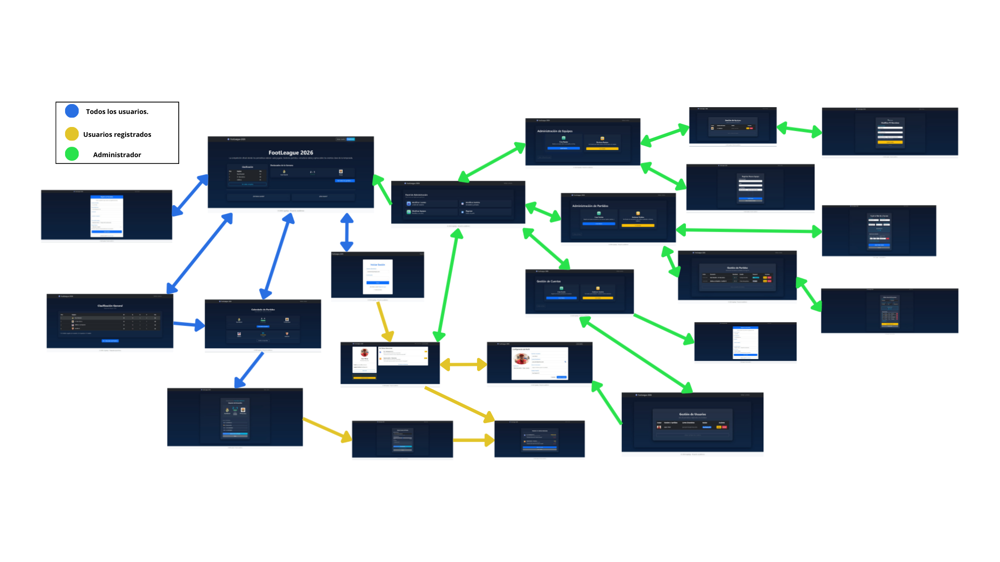

> El flujo de navegación se divide en tres niveles de permisos. El Usuario Anónimo accede a la información pública como resultados (match-list), estadísticas (classification) y el registro. El Usuario Registrado dispone de un área privada (profile) para gestionar su cuenta y realizar valoraciones. Por último, el Administrador tiene acceso exclusivo a los paneles de gestión global (Admin_Page), permitiéndole el control total (CRUD) sobre las entidades de equipos, partidos y cuentas de usuario.

### **Capturas de Pantalla y Descripción de Páginas**

#### **1. Página Principal / Home**
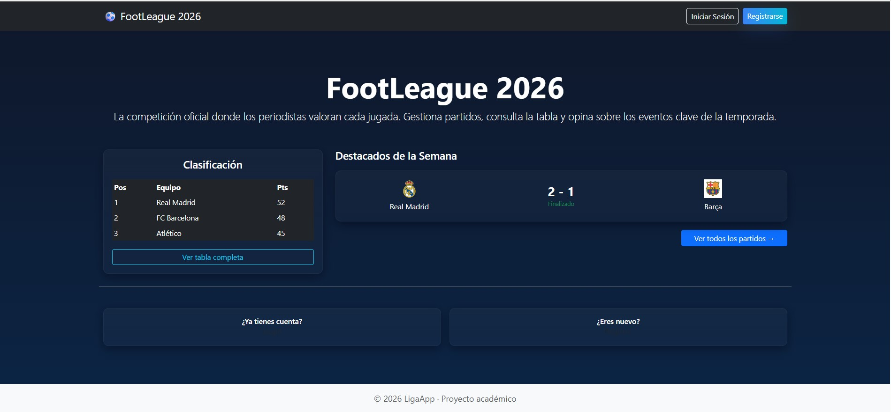

> [Puerta de entrada principal con el listado de partidos, clasificación y acceso global a la navegación.]
#### **2. Página de login**
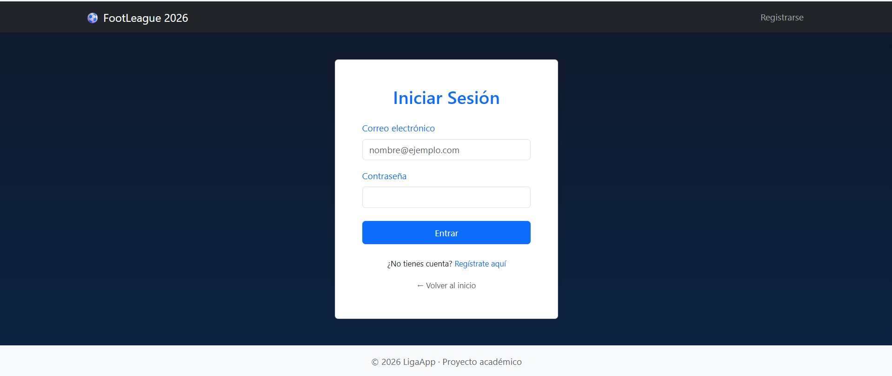

> [Formulario de acceso para usuarios registrados (periodistas) y administradores.]
#### **3. Página de registro**
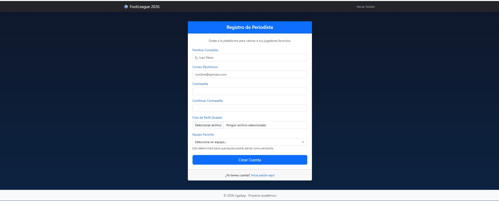

> [Formulario de registro para nuevos periodistas deportivos.]
#### **4. Página de perfil**
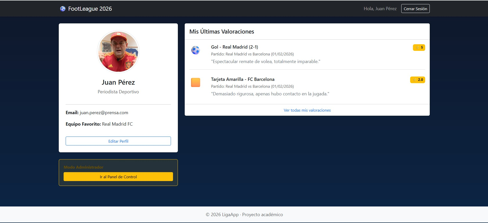

> [Panel personal del usuario donde se visualizan sus datos y valoraciones, además de mostrar un panel para acceder a la página de administrador.]
#### **5. Página de editar perfil**
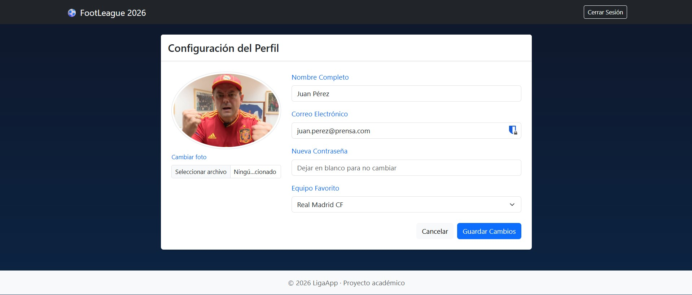

> [Interfaz para que el usuario modifique su información y preferencias.]
#### **6. Página de todas las valoraciones**
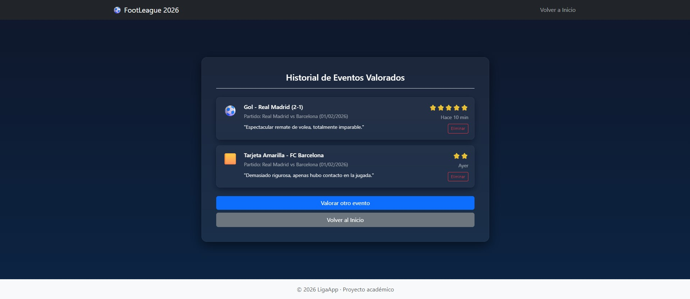

> [Listado histórico de todas las valoraciones realizadas por el periodista.]
#### **7. Página principal de administrador**
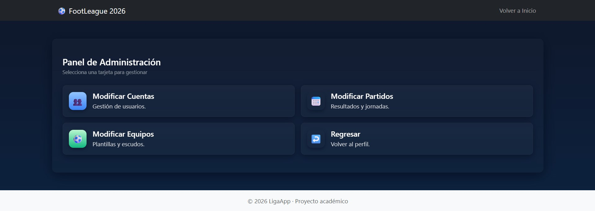

> [Panel central con tarjetas de navegación hacia las distintas áreas de gestión.]
#### **8. Página de administación de cuentas**
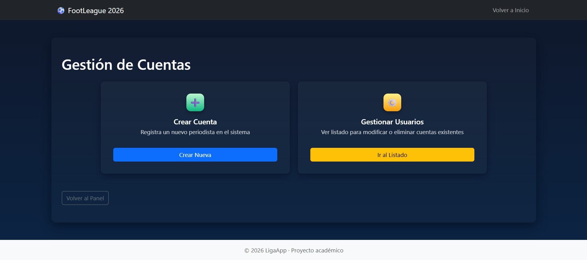

> [Interfaz donde el administrador puede crear usuarios y ver el listado de usuarios pudiendo editarlos o eliminarlos.]
#### **9. Página de administación de partidos**
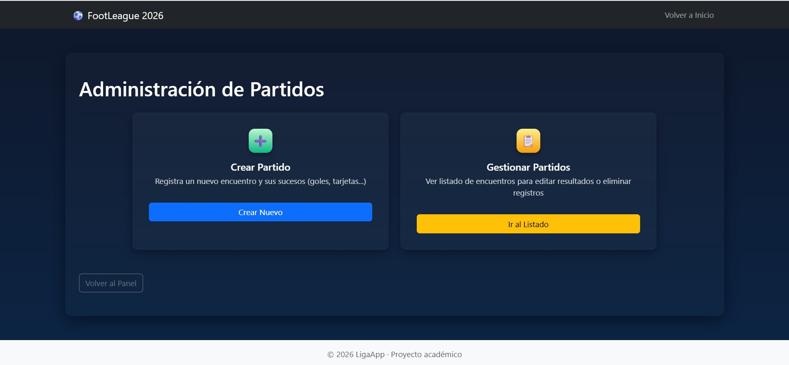

> [Interfaz para que el administrador cree o modifique partidos.]
#### **10. Página de administación de equipos**
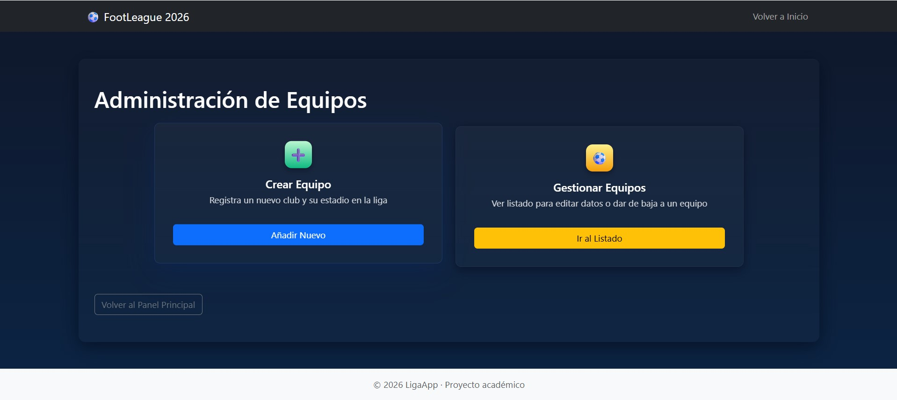

> [Gestión integral de los equipos inscritos en la liga.]
#### **11. Página de cración de partidos**
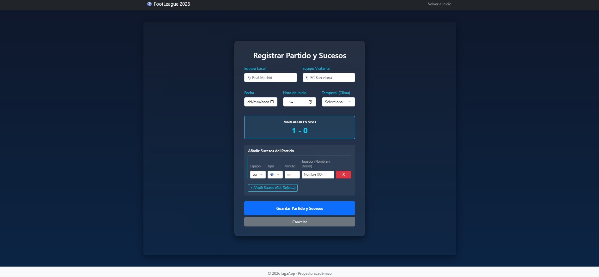

> [Interfaz donde el administrador crea los partidos de la liga.]
#### **12. Página de cración de equipos**
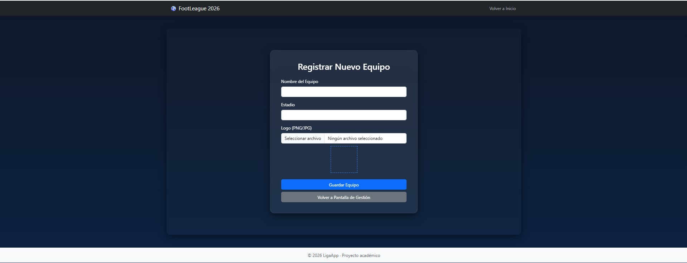

> [Interfaz donde el administrador crea los equipos de la liga.]
#### **13. Página para editar partidos**
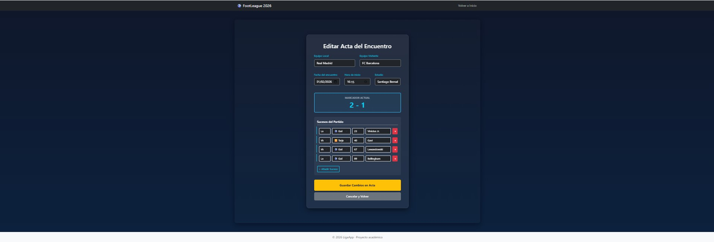

> [Interfaz donde el administrador puede editar los partidos de la liga.]
#### **14. Página para editar equipos**
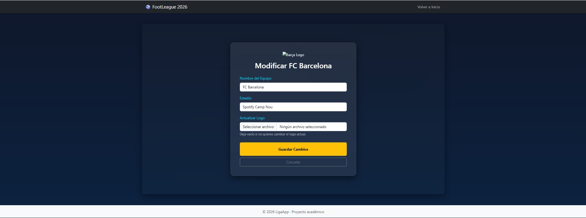

> [Interfaz donde el administrador puede editar los equipos de la liga.]
#### **15. Página del listado de usuarios**
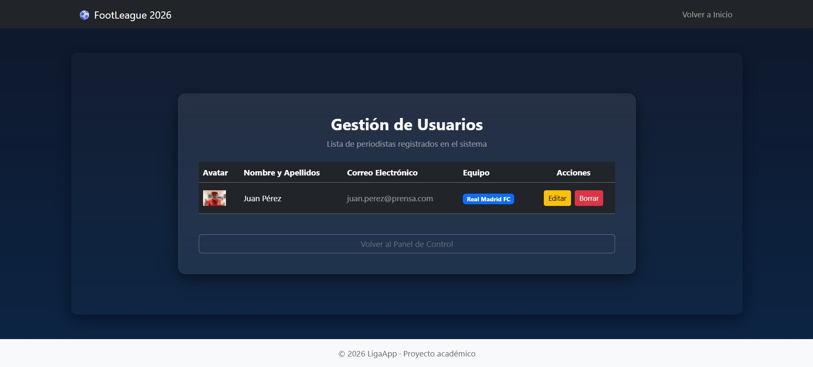

> [Interfaz donde se muestra un listado de usuarios registrados pudiendo editarlos o eliminarlos.]
#### **16. Página del listado de partidos**
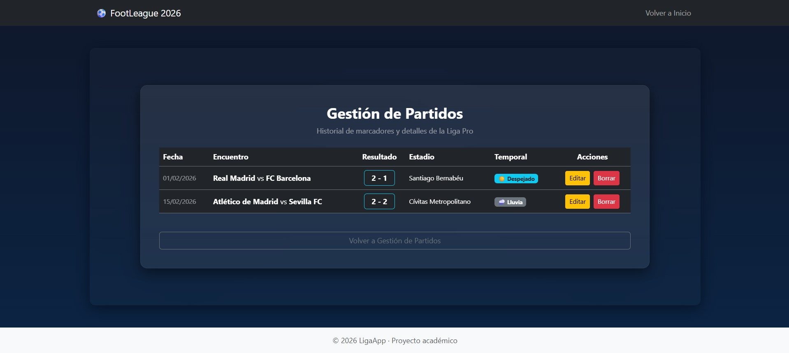

> [Interfaz donde se muestra el listado de partidos de la liga pudiendo editarlos o eliminarlos.]
#### **17. Página del listado de equipos**
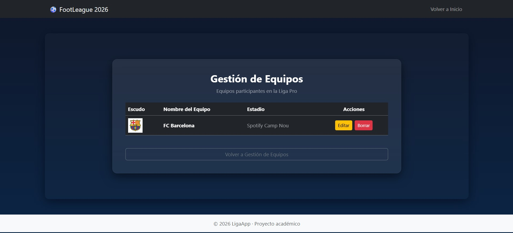

> [Interfaz donde se muestra el listado de equipos de la liga pudiendo editarlos o eliminarlos.]
#### **18. Página de la clasificación de la liga**
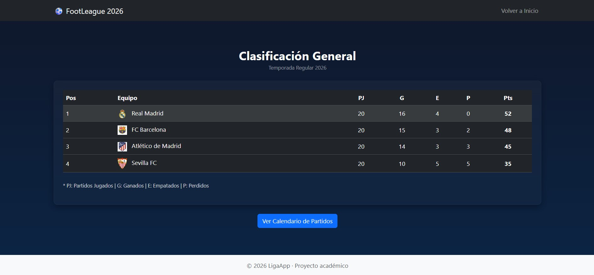

> [Interfaz donde se muestra la clasificación de la liga con todos sus detalles.]
#### **19. Página del acta del partido**
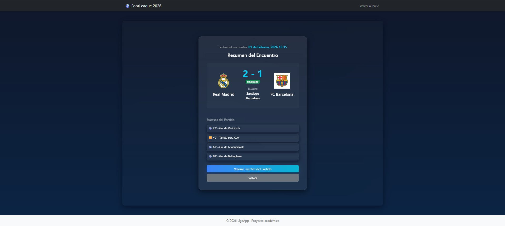

> [Interfaz donde se muestra el acta del partido con todos los eventos ocurridos en él.]
#### **20. Página del calendario de la liga**
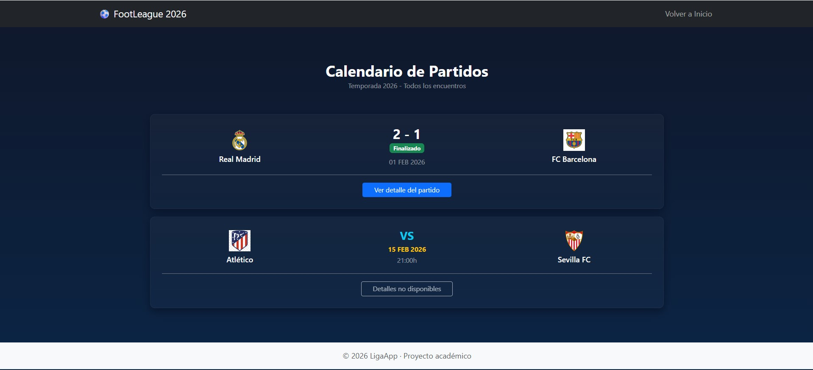

> [Interfaz donde se muestra el calendario de todos los partidos de la liga.]
#### **21. Página para valorar un evento**
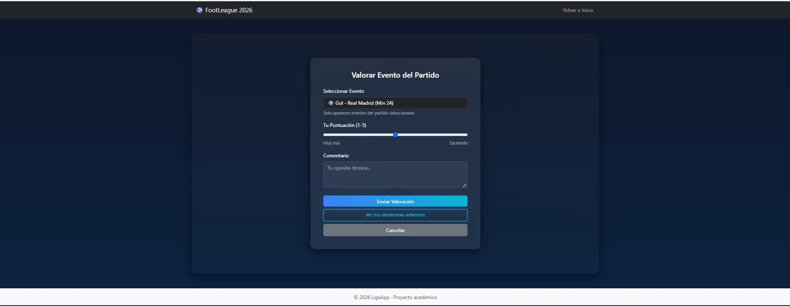

> [Interfaz donde se puede realizar una valoración sobre un evento de un partido determinado.]
### **Participación de Miembros en la Práctica 1**

#### **Alumno 1 - Jaime Tejero Fernández**

El alumno Jaime Tejero será encargado de la parte de administrador de la página web, esto incluye creación y modificación de equipos, evento y usuarios

| Nº    | Commits      | Files      |
|:------------: |:------------:| :------------:|
|1| [Creación inicio de Pagina De opciones de Administrador provisional para crear un esqueleto sobre el que trabajar](https://github.com/DWS-2026/project-grupo-11/commit/7baa33387f82ab0e3b71a1e8c4ef68cd4637cbac)  | [Pagina_Admin.html](https://github.com/DWS-2026/project-grupo-11/blob/7baa33387f82ab0e3b71a1e8c4ef68cd4637cbac/HTML/Pagina_Admin.html)   |
|2| [Añadida navegación con SweetAlert debido a conflictos con el CSS, Creacion del CSS comun para la pagina y finalizacion de la pagina panel de administrador añadiendo las opciones necesarias](https://github.com/DWS-2026/project-grupo-11/commit/9897a534d0fa390c21d2f0a6817b2be7ef25349c)  | [Pagina_Admin.html](https://github.com/DWS-2026/project-grupo-11/blob/9897a534d0fa390c21d2f0a6817b2be7ef25349c/HTML/Pagina_Admin.html), [style.css](https://github.com/DWS-2026/project-grupo-11/blob/9897a534d0fa390c21d2f0a6817b2be7ef25349c/css/styles.css)   |
|3| [Añadido la pantalla de Gestion de Cuentas y Partidos con base de la Pantalla Gestion Equipos, eliminacion temporal de alertas por errores con el CSS](https://github.com/DWS-2026/project-grupo-11/commit/e96b80c586507a322a48c98378f632a2b91d29e5)  | [Pantalla_Gestion_Partidos.html](https://github.com/DWS-2026/project-grupo-11/blob/e96b80c586507a322a48c98378f632a2b91d29e5/HTML/Pantalla_Gestion_Partidos.html), [Pantalla_Gestion_Cuentas.html](https://github.com/DWS-2026/project-grupo-11/blob/e96b80c586507a322a48c98378f632a2b91d29e5/HTML/Pantalla_Gestion_Cuentas.html)  |
|4| [Solucion Match_Management_Screen.html mal estructuradamain](https://github.com/DWS-2026/project-grupo-11/commit/fb30af35ca314d777db7023843fa7a652160ffd2)  | [Match_Management_Screen.html](https://github.com/DWS-2026/project-grupo-11/blob/fb30af35ca314d777db7023843fa7a652160ffd2/HTML/Match_Management_Screen.html)   |
|5| [Actualizadas funcionalidades buscar equipo, regresar a pantalla de inicio (cambiada por regreso a perfil), buscar usuario, eliminar usuario, modificar usuario y modificar equipo junto a pagina FC Barcelona](https://github.com/DWS-2026/project-grupo-11/commit/492f5384391b20ea554a4fc9abaff5730bc03085)  | [Admin_Page.html](https://github.com/DWS-2026/project-grupo-11/blob/492f5384391b20ea554a4fc9abaff5730bc03085/HTML/Admin_Page.html), [CreateAccount.html](https://github.com/DWS-2026/project-grupo-11/blob/492f5384391b20ea554a4fc9abaff5730bc03085/HTML/CreateAccount.html), [DeleteAccount.html](https://github.com/DWS-2026/project-grupo-11/blob/492f5384391b20ea554a4fc9abaff5730bc03085/HTML/DeleteAccount.html), [EditTeamBarcelona.html](https://github.com/DWS-2026/project-grupo-11/blob/492f5384391b20ea554a4fc9abaff5730bc03085/HTML/EditTeamBarcelona.html), [ModifyAccount.html](https://github.com/DWS-2026/project-grupo-11/blob/492f5384391b20ea554a4fc9abaff5730bc03085/HTML/ModifyAccount.html),  [ModifyTeam.html](https://github.com/DWS-2026/project-grupo-11/blob/492f5384391b20ea554a4fc9abaff5730bc03085/HTML/ModifyTeam.html) |
|6| [Actualizadas funcionalidades buscar usuario](https://github.com/DWS-2026/project-grupo-11/commit/44345cc115a1ac1ed7fef186b4767bc200ac04b1)  | [ModifyAccount.html](https://github.com/DWS-2026/project-grupo-11/commit/44345cc115a1ac1ed7fef186b4767bc200ac04b1/HTML/ModifyAccount.html)   |
|7| [Refactor: Sustituidos buscadores manuales por tablas de gestión dinámica en Usuarios y Equipos. Unificadas funciones de Modificar/Eliminar y añadido creacion de partidos y  registro de eventos (goles/tarjetas) en la creación de partidos](https://github.com/DWS-2026/project-grupo-11/commit/fb31e50506eb62d40e2b31902ef0bdde42d431ee#diff-64779b39e77a7af020f0fa5f8b836f1663c171b04808a488f5db96547c2ccad1)  | [](*)   |
|8| [Actualizacion resultado dinamico en createMatch.html](https://github.com/DWS-2026/project-grupo-11/commit/c06134949427e37424c7cf0c0e742c380bae92a1#diff-bc4ad04f795105d8dc2153eb5aa19fa12b892a9b057f70d045496e85e8741ff5)  | [CreateMatch.html](https://github.com/DWS-2026/project-grupo-11/commit/c06134949427e37424c7cf0c0e742c380bae92a1#diff-bc4ad04f795105d8dc2153eb5aa19fa12b892a9b057f70d045496e85e8741ff5/HTML/CreateMatch.html)   |
|9| [Finalizacion de la interfaz crear partidos y gestionar partidos](https://github.com/DWS-2026/project-grupo-11/commit/a1e9bcdbbf9bc94166b47ee5aca65902c6c9fe1d)  | [HTML/ModifyMatch.html](https://github.com/DWS-2026/project-grupo-11/commit/a1e9bcdbbf9bc94166b47ee5aca65902c6c9fe1d/HTML/ModifyMatch.html), *   |


---

#### **Alumno 2 - Rubén Sánchez López**

Mi aportación se centró en desarrollar la interfaz pública y la experiencia del usuario, implementando la visualización dinámica de partidos, los eventos en tiempo real y el sistema de valoraciones.

| Nº    | Commits      | Files      |
|:------------: |:------------:| :------------:|
|1| [Maquetación inicial de detalle de partido y eventos.](https://github.com/DWS-2026/project-grupo-11/commit/7eb85548ad3438347230cdfd8fb8433d675e794f)  | [partido-detalle.html](https://github.com/DWS-2026/project-grupo-11/commit/7eb85548ad3438347230cdfd8fb8433d675e794f#diff-b1f380592c7f5433ea91292b2726f95cce071aaf17589c48ec4f3f5c2147ef7f)   |
|2| [Creada la home con lista de partidos y cards](https://github.com/DWS-2026/project-grupo-11/commit/6d310db6cb3baf4e0c625b1688dff5f18b9af659)  | [index.html](https://github.com/DWS-2026/project-grupo-11/commit/6d310db6cb3baf4e0c625b1688dff5f18b9af659#diff-c9caeff2e64b497a71a0cc0d2ba6f659ff3d653b2913129a6a4ee33d3cf8f868)   |
|3| [Cambio de Liga Proyect a Liga Pro](https://github.com/DWS-2026/project-grupo-11/commit/8801129947b786fdf121545573446750e4631d0d)  | [player-ratings.html](https://github.com/DWS-2026/project-grupo-11/commit/8801129947b786fdf121545573446750e4631d0d#diff-e7cdad96aad0e5ff97fb92912a5800e7df8a6ea761dd181f97ec6a4f2b7b2a63)   |
|4| [Add my-ratings view to show user feedback history](https://github.com/DWS-2026/project-grupo-11/commit/f5e299fa37ff787d713e53d8fe88c1f12f62b398)  | [my-ratings.html](https://github.com/DWS-2026/project-grupo-11/commit/f5e299fa37ff787d713e53d8fe88c1f12f62b398#diff-46aa992c5047cba950f8a2215b7ea5ec32e8bc4115cbfb9ea782d218bfed6eac)   |
|5| [Refactor UI y navegación: Clasificación, Listado de Partidos y Valoración de Eventos](https://github.com/DWS-2026/project-grupo-11/commit/fc36d3b38e1c8ddc8172cfd24e1944bd866ed056#diff-9e4be119b5d8791da9edf9d513e3586795b3ece00680fa31d46c8860381738e6)  | [classification.html](https://github.com/DWS-2026/project-grupo-11/commit/fc36d3b38e1c8ddc8172cfd24e1944bd866ed056#diff-9e4be119b5d8791da9edf9d513e3586795b3ece00680fa31d46c8860381738e6), [index.html](https://github.com/DWS-2026/project-grupo-11/commit/fc36d3b38e1c8ddc8172cfd24e1944bd866ed056#diff-c9caeff2e64b497a71a0cc0d2ba6f659ff3d653b2913129a6a4ee33d3cf8f868), [match-list.html](https://github.com/DWS-2026/project-grupo-11/commit/fc36d3b38e1c8ddc8172cfd24e1944bd866ed056#diff-32197a9a681d4b0cff0f309c671bb8481f43fd908d1bb1d3516d01086f56196c), [my-ratings.html](https://github.com/DWS-2026/project-grupo-11/commit/fc36d3b38e1c8ddc8172cfd24e1944bd866ed056#diff-46aa992c5047cba950f8a2215b7ea5ec32e8bc4115cbfb9ea782d218bfed6eac), [player-ratings.html](https://github.com/DWS-2026/project-grupo-11/commit/fc36d3b38e1c8ddc8172cfd24e1944bd866ed056#diff-e7cdad96aad0e5ff97fb92912a5800e7df8a6ea761dd181f97ec6a4f2b7b2a63)   |
|6| [UI: Split matches into columns and added dates to upcoming games](https://github.com/DWS-2026/project-grupo-11/commit/d11b56ea9a22b5ae0736d888bcb072ccbac8933d)  | [index.html](https://github.com/DWS-2026/project-grupo-11/commit/d11b56ea9a22b5ae0736d888bcb072ccbac8933d#diff-c9caeff2e64b497a71a0cc0d2ba6f659ff3d653b2913129a6a4ee33d3cf8f868), [match-details.html](https://github.com/DWS-2026/project-grupo-11/commit/d11b56ea9a22b5ae0736d888bcb072ccbac8933d#diff-d4673f6089deb4a16f4530275aed71cbe57b2218b427477b27d98e18885b3911)   |
|7| [Switched ratings from Players to Match Events (Goal, Cards, Subs)](https://github.com/DWS-2026/project-grupo-11/commit/f368aa4ea730d21621dd0aa9c279e68113e814b1)  | [match-details.html](https://github.com/DWS-2026/project-grupo-11/commit/f368aa4ea730d21621dd0aa9c279e68113e814b1#diff-d4673f6089deb4a16f4530275aed71cbe57b2218b427477b27d98e18885b3911), [my-ratings.html](https://github.com/DWS-2026/project-grupo-11/commit/f368aa4ea730d21621dd0aa9c279e68113e814b1#diff-46aa992c5047cba950f8a2215b7ea5ec32e8bc4115cbfb9ea782d218bfed6eac), [player-ratings.html](https://github.com/DWS-2026/project-grupo-11/commit/f368aa4ea730d21621dd0aa9c279e68113e814b1#diff-e7cdad96aad0e5ff97fb92912a5800e7df8a6ea761dd181f97ec6a4f2b7b2a63)   |

---

#### **Alumno 3 - Sergio Sánchez López**

Me encargué de la autenticación de usuarios (login y registro), del diseño y maquetación del perfil de usuario, y de los formularios asociados, incluyendo la edición de perfil, selección de equipo favorito y uso de campos HTML bien tipados.

| Nº    | Commits      | Files      |
|:------------: |:------------:| :------------:|
|1| [Añadir diseño de la página de inicio de sesión con Bootstrap](https://github.com/DWS-2026/project-grupo-11/commit/e18183fbcd337c4c39c5324c52f2668e9f359187)  | [login.html](https://github.com/DWS-2026/project-grupo-11/commit/e18183fbcd337c4c39c5324c52f2668e9f359187#diff-f6181bdad2f9eb4c11b593518b97d18ed818e3c25f9e249236758c1e47a2d201)   |
|2| [Crear formulario de registro de usuario con tipos de entrada adecuados](https://github.com/DWS-2026/project-grupo-11/commit/e18183fbcd337c4c39c5324c52f2668e9f359187)  | [registration.html](https://github.com/DWS-2026/project-grupo-11/commit/e18183fbcd337c4c39c5324c52f2668e9f359187#diff-678b41f554fc522ea9b2667684636912e6da63d8c6a60ae0f56a84f38b80b578)   |
|3| [Implementar el diseño de la página de perfil de usuario](https://github.com/DWS-2026/project-grupo-11/commit/af5881ff9d0d928482aebbd6633f63f27d2c746b)  | [profile.html](https://github.com/DWS-2026/project-grupo-11/commit/af5881ff9d0d928482aebbd6633f63f27d2c746b#diff-94c8caeb27cc8da815d3b8daeeb0a1bc9628cce47ea1db8e17ecb817535845a1)   |
|4| [Añadir formulario de edición de perfil y selección de equipo favorito](https://github.com/DWS-2026/project-grupo-11/commit/72ae6eb4f541356c113e9dc314d66011ae6cd737)  | [edit-profile.html](https://github.com/DWS-2026/project-grupo-11/commit/72ae6eb4f541356c113e9dc314d66011ae6cd737#diff-b314f77d096679a612f85f27d64ef1d521dfa51e1d410d5d4e7c520e5b9739da)   |
|5| [Añadido panel de administración en la página de perfil de usuario](https://github.com/DWS-2026/project-grupo-11/commit/65252c0c123d43ad9fd2d297b14b1df510073d28)  | [profile.html](github.com/DWS-2026/project-grupo-11/commit/65252c0c123d43ad9fd2d297b14b1df510073d28#diff-94c8caeb27cc8da815d3b8daeeb0a1bc9628cce47ea1db8e17ecb817535845a1)   |
|6| [Mejorados todos los pequeños detalles de la página del login](https://github.com/DWS-2026/project-grupo-11/commit/e587ba3c9ebf57b68ff796de5aa2efa041aa495a)  |  [login.html](https://github.com/DWS-2026/project-grupo-11/commit/e587ba3c9ebf57b68ff796de5aa2efa041aa495a#diff-f6181bdad2f9eb4c11b593518b97d18ed818e3c25f9e249236758c1e47a2d201)  |
|7| [Mejorados todos los pequeños detalles de la página de registro](https://github.com/DWS-2026/project-grupo-11/commit/e587ba3c9ebf57b68ff796de5aa2efa041aa495a)  |  [registration.html](https://github.com/DWS-2026/project-grupo-11/commit/e587ba3c9ebf57b68ff796de5aa2efa041aa495a#diff-678b41f554fc522ea9b2667684636912e6da63d8c6a60ae0f56a84f38b80b578)

---

#### **Alumno 4 - [Nombre Completo]**

[Descripción de las tareas y responsabilidades principales del alumno en el proyecto]

| Nº    | Commits      | Files      |
|:------------: |:------------:| :------------:|
|1| [Descripción commit 1](URL_commit_1)  | [Archivo1](URL_archivo_1)   |
|2| [Descripción commit 2](URL_commit_2)  | [Archivo2](URL_archivo_2)   |
|3| [Descripción commit 3](URL_commit_3)  | [Archivo3](URL_archivo_3)   |
|4| [Descripción commit 4](URL_commit_4)  | [Archivo4](URL_archivo_4)   |
|5| [Descripción commit 5](URL_commit_5)  | [Archivo5](URL_archivo_5)   |

---

## 🛠 **Práctica 2: Web con HTML generado en servidor**

### **Vídeo de Demostración**
📹 **[Enlace al vídeo en YouTube](https://youtu.be/hh3OunsPlZo)**
> Vídeo mostrando las principales funcionalidades de la aplicación web.

### **Navegación y Capturas de Pantalla**

#### **Diagrama de Navegación**

Solo si ha cambiado.

#### **Capturas de Pantalla Actualizadas**
La app sigue usando las mismas vistas que en la Práctica 1 para no cargarnos la usabilidad que ya funcionaba bien. Lo que más cambia a nivel visual es el header y el footer. El Header incluye el control de seguridad de Spring Security, y junto con el nuevo Footer le da a toda la plataforma un aspecto más sólido y coherente.
#### **Header y Footer actualizados**
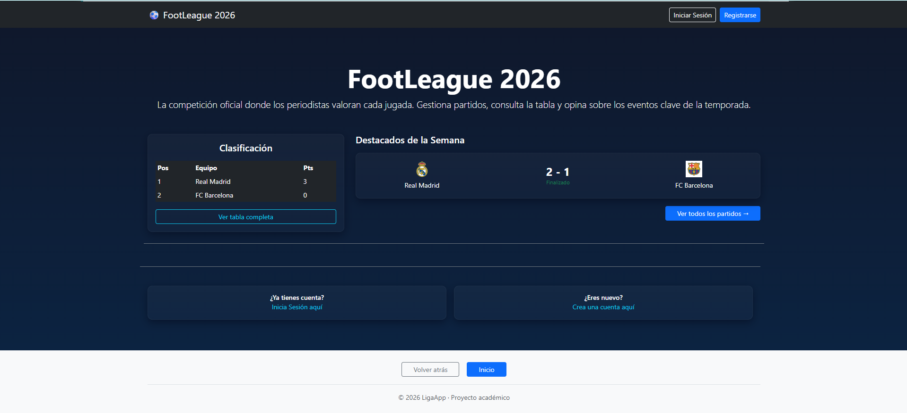
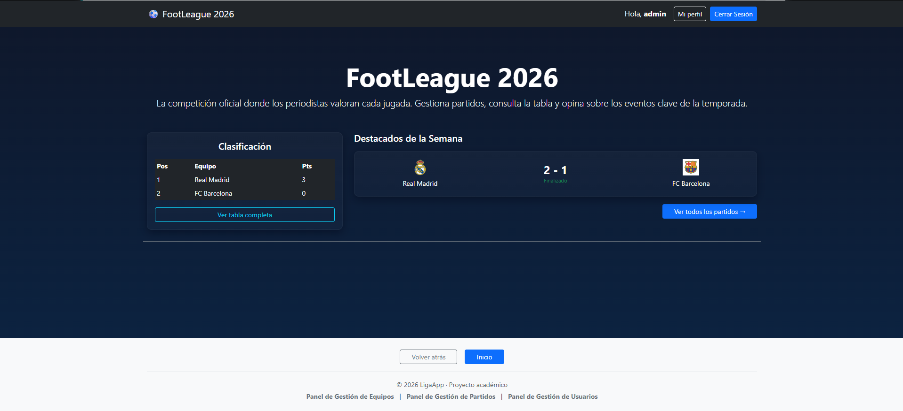

### **Instrucciones de Ejecución**

#### **Requisitos Previos**
- **Java**: versión 21 o superior
- **Maven**: versión 3.8 o superior
- **MySQL**: versión 8.0 o superior
- **Git**: para clonar el repositorio

#### **Pasos para ejecutar la aplicación**

1. **Clonar el repositorio**
   ```bash
   git https://github.com/CodeURJC-DAW-2025-26/project-grupo-11.git
   cd project-grupo-11.git
   ```

2. **Configurar la Base de Datos (MySQL)**
   Abre tu terminal de MySQL o MySQL Workbench.
   Crea la base de datos necesaria para el proyecto:
   ```SQL
   CREATE DATABASE footleague
   ```
   Si has cambiado el usuario o la contraseña de tu MySQL local, abre el archivo src/main/resources/application.properties y actualiza estas         líneas:
   ```Properties
   spring.datasource.url=jdbc:mysql://localhost:3306/footleague_db
   spring.datasource.username=tu_usuario
   spring.datasource.password=tu_contraseña
   ```
3. **Compilar e instalar las dependencias**
4. **Ejecutar la aplicación desde el IDE**
   Localiza la clase principal del proyecto: src/main/java/es/footleague/app/FootballApplication.java.
   Haz clic derecho sobre el archivo o busca el icono de "Run" (un triángulo verde ▶️) que aparece junto a la definición de la clase: public        class FootballApplication.
   Selecciona "Run 'FootballApplication'".
   La consola integrada del IDE mostrará el log de Spring Boot indicando que el servidor se ha levantado correctamente.
5. **Acceder a la web**
   Una vez que en la consola aparezca el mensaje Started ... in X seconds, abre tu navegador y entra en:
   https://localhost:8443

#### **Credenciales de prueba**
- **Usuario Admin**: usuario: `admin`, contraseña: `admin123`
- **Usuario Registrado**: usuario: `JuanPerez`, contraseña: `password123`

### **Diagrama de Entidades de Base de Datos**

Diagrama mostrando las entidades, sus campos y relaciones:


> [El diagrama muestra las entidades principales de la aplicación FootLeague: User, Team y Match, junto con sus relaciones. Un usuario puede gestionar equipos, y los equipos participan en partidos como local y visitante.]

### **Diagrama de Clases y Templates**

Diagrama de clases de la aplicación con diferenciación por colores o secciones:

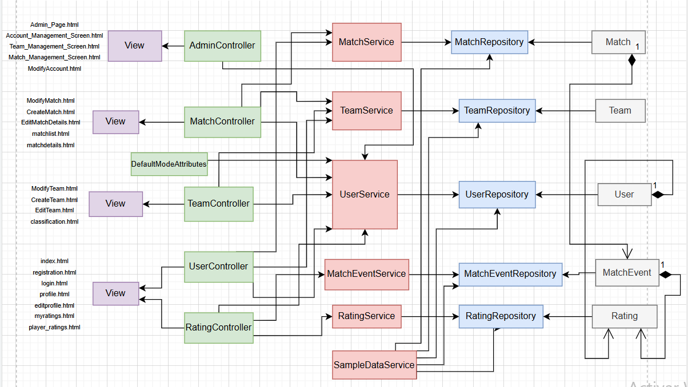

> [El diagrama muestra la arquitectura de la aplicación FootLeague. La idea de usar colores es básicamente para ver rápido quién hace qué. Las vistas (morado) hablan con los controladores (verde), que son los que organizan toda la lógica del negocio usando los servicios (rojo). Esos servicios, a su vez, tiran de los datos de las entidades (gris) a través de los repositorios (azul). Todo esto funciona dentro de un entorno protegido por Spring Security.]

### **Participación de Miembros en la Práctica 2**

#### **Alumno 1 - Jaime Tejero Fernández**

Las principales responsabilidades de Jaime fueron la creacion de pantallas de error y los modulos CRUD de equipos y partidos, asi como la creacion de algunas pantallas o funcionalidades relacionadas con partidos o equipos como la implementacion de clasificacion a tiempo real y cambio de comentarios a ingles.

| Nº    | Commits      | Files      |
|:------------: |:------------:| :------------:|
|1| [Cambios grandes en la creacion de equipos del /admin](https://github.com/DWS-2026/project-grupo-11/commit/c355cb36aa5f98d424f967d3bd6f5e355dbc17fc)  | [RatingController](src/main/java/es/footleague/app/controller/RatingController.java), [TeamRestController](src/main/java/es/footleague/app/controller/TeamRestController.java), [ViewController](src/main/java/es/footleague/app/controller/ViewController.java),  [Team](src/main/java/es/footleague/app/model/Team.java), [TeamService](src/main/java/es/footleague/app/services/TeamService.java), [aplication.properties](src/main/resources/aplication.properties.java), [Team_Mangement](src/main/resources/static/js/Team_Management.js), [create_team](src/main/resources/static/create_team.js), [match_logic](src/main/resources/static/js/match_logic.js), [CreateTeam](src/main/resources/templates/CreateTeam.html), [EditTeam](src/main/resources/templates/EditTeam.html), [ModifyTeam](src/main/resources/templates/ModifyTeam.html), [Team_Management_Screen](src/main/resources/templates/Team_Mangement_Screen.html),|
|2| [Cambios Edicion de partido](https://github.com/DWS-2026/project-grupo-11/commit/9e702733e30af41ed19f3c9f2386c9461135d7f6)  | [Match.java](src/main/java/es/footleague/app/model/Match.java), [MatchEvent.java](src/main/java/es/footleague/app/model/MatchEvent.java), [EditMatchDetails.java](src/main/resources/templates/EditMatchDetails.html)  |
|3| [Creadas pantallas de error](https://github.com/DWS-2026/project-grupo-11/commit/26fcec4c91d5896217e906dd66432a70a3f004c8)  | [ErrorRestController](src/main/java/es/footleague/app/controller/ErrorTestController.java), [400](src/main/resources/templates/error/400.html), [503](src/main/resources/templates/error/503.html), [403](src/main/resources/templates/error/403.html), [409](src/main/resources/templates/error/409.html), [500](src/main/resources/templates/error/500.html)|
|4| [solucion https y bug en creacion de equipos (mirar error no deja ver partido si lo creas en la web)](https://github.com/DWS-2026/project-grupo-11/commit/d4544bdaf8ee1fd5420a120f28ee986c2cf9fa00)  | [aplication.properties](src/main/resources/application.properties), [keystore.p12](src/main/resources/keystore.p12), [create_team.js](src/main/resources/static/js/create_team.js)    |
|5| [Modificaciones en rutas y en la entidad teams](https://github.com/DWS-2026/project-grupo-11/commit/b6e3ab7db536cd55b785133014291a63e049d931)  | [TeamController](src/main/java/es/footleague/app/controller/TeamController.java), [TeamManagement](src/main/resources/static/js/Team_Management.js), [create_team](src/main/resources/static/js/create_team.js), [ModifyTeam](src/main/resources/templates/ModifyTeam.html), [index](src/main/resources/templates/index.html),   |

---

#### **Alumno 2 - [Ruben Sanchez Lopez]**

[Responsable de la definición del modelo de datos, la gestión de la persistencia y la implementación de la capa de seguridad y usuarios.]

| Nº    | Commits      | Files      |
|:------------: |:------------:| :------------:|
|1| [completadas las clases Match, MatchEvent y Team](https://github.com/DWS-2026/dws-2026-project-base/commit/daeacd0290b0a0d492f4397ec827d2761cb3d7de)  | [Match.java](src/main/java/es/model/Match.java), [MatchEvent.java](src/main/java/es/model/MatchEvent.java), [Team.java](src/main/java/es/model/Team.java)   |
|2| [completadas todas las entidades y los repositorios de cada entidad](https://github.com/DWS-2026/dws-2026-project-base/commit/d1093af92f6663d50d2c65ada99f6d7ab7cc61ad)  | [pom.xml](pom.xml), [Match.java](src/main/java/es/footleague/app/model/Match.java), [MatchEvent](src/main/java/es/footleague/app/model/MatchEvent.java), [Rating.java](src/main/java/es/footleague/app/model/Rating.java), [Team.java](src/main/java/es/footleague/app/model/Team.java), [User.java](src/main/java/es/footleague/app/model/User.java), [MatchEventRepository.java](src/main/java/es/footleague/app/repository/MatchEventRepository.java), [MatchRepository.java](src/main/java/es/footleague/app/repository/MatchRepository.java), [RatingRepository.java](src/main/java/es/footleague/app/repository/RatingRepository.java), [TeamRepository.java](src/main/java/es/footleague/app/repository/TeamRepository.java), [UserRepository.java](src/main/java/es/footleague/app/repository/UserRepository.java)   |
|3| [cambiados todos los html de thymeleaf a mustache, tambien se ha cambiado el pom.xml y el application.properties](https://github.com/DWS-2026/dws-2026-project-base/commit/5e2642515f50c0002d7b1526f06add47c517d6d7)  | [pom.xml](pom.xml), [application.properties](src/main/resources/application.properties), [Account_Management_Screen.html](src/main/resources/templates/Account_Management_Screen.html), [Admin_Page.html](src/main/resources/templates/Admin_Page.html), [CreateMatch.html](src/main/resources/templates/CreateMatch.html), [CreateTeam.html](src/main/resources/templates/CreateTeam.html), [EditMatchDetails.html](src/main/resources/templates/EditMatchDetails.html), [EditTeamBarcelona.html](src/main/resources/templates/EditTeamBarcelona.html), [Match_Management_Screen.html](src/main/resources/templates/Match_Management_Screen.html), [ModifyAccount.html](src/main/resources/templates/ModifyAccount.html), [ModifyMatch.html](src/main/resources/templates/ModifyMatch.html), [ModifyTeam.html](src/main/resources/templates/ModifyTeam.html), [Team_Management_Screen.html](src/main/resources/templates/Team_Management_Screen.html), [classification.html](src/main/resources/templates/classification.html), [edit-profile.html](src/main/resources/templates/edit-profile.html), [footer.html](src/main/resources/templates/fragments/footer.html), [header.html](src/main/resources/templates/fragments/header.html), [index.html](src/main/resources/templates/index.html), [login.html](src/main/resources/templates/login.html), [match-details.html](src/main/resources/templates/match-details.html), [match-list.html](src/main/resources/templates/match-list.html), [my-ratings.html](src/main/resources/templates/my-ratings.html), [player-ratings.html](src/main/resources/templates/player-ratings.html), [profile.html](src/main/resources/templates/profile.html), [registration.html](src/main/resources/templates/registration.html)   |
|4| [creado el UserController y modificados los html de perfil](https://github.com/DWS-2026/dws-2026-project-base/commit/040ee704a2fefeaf392910bf7175bc6428e5727b)  | [UserController.java](src/main/java/es/footleague/app/controller/UserController.java), [edit-profile.html](src/main/resources/templates/edit-profile.html), [profile.html](src/main/resources/templates/profile.html), [registration.html](src/main/resources/templates/registration.html)   |
|5| [Corregidos los errores del login y de mas formularios](https://github.com/DWS-2026/dws-2026-project-base/commit/80f6f72f0c1209b0157028fe2a23e4960e953dbf)  | [RatingController.java](src/main/java/es/footleague/app/controller/RatingController.java), [UserController.java](src/main/java/es/footleague/app/controller/UserController.java), [CSRFHandlerConfiguration.java](src/main/java/es/footleague/app/security/CSRFHandlerConfiguration.java), [RepositoryUserDetailsService.java](src/main/java/es/footleague/app/security/RepositoryUserDetailsService.java), [WebSecurityConfig.java](src/main/java/es/footleague/app/security/WebSecurityConfig.java), [SampleDataService.java](src/main/java/es/footleague/app/services/SampleDataService.java), [UserService.java](src/main/java/es/footleague/app/services/UserService.java), [CreateMatch.html](src/main/resources/templates/CreateMatch.html), [edit-profile.html](src/main/resources/templates/edit-profile.html), [header.html](src/main/resources/templates/fragments/header.html), [index.html](src/main/resources/templates/index.html), [login.html](src/main/resources/templates/login.html), [player-ratings.html](src/main/resources/templates/player-ratings.html), [profile.html](src/main/resources/templates/profile.html), [registration.html](src/main/resources/templates/registration.html)   |

---

#### **Alumno 3 - Sergio Sánchez López**

Me encargué de la configuración inicial del entorno y la estructura de persistencia en la base de datos. Mi mayor aporte al desarrollo de funcionalidades fue reforzar la seguridad del sitio aplicando restricciones de acceso por rol de administrador en los controladores principales. Finalmente, realicé la carga de información de prueba con SampleDataService.

| Nº    | Commits      | Files      |
|:------------: |:------------:| :------------:|
|1| Proyecto estructurado en carpetas(https://github.com/DWS-2026/project-grupo-11/commit/0823aacf05d57acd7a770c72379885bfc436cc31)  | .gitatributtes(https://github.com/DWS-2026/project-grupo-11/commit/0823aacf05d57acd7a770c72379885bfc436cc31#diff-618cd5b83d62060ba3d027e314a21ceaf75d36067ff820db126642944145393e), .gitignore(https://github.com/DWS-2026/project-grupo-11/commit/0823aacf05d57acd7a770c72379885bfc436cc31#diff-bc37d034bad564583790a46f19d807abfe519c5671395fd494d8cce506c42947), pom.xml(https://github.com/DWS-2026/project-grupo-11/commit/0823aacf05d57acd7a770c72379885bfc436cc31#diff-9c5fb3d1b7e3b0f54bc5c4182965c4fe1f9023d449017cece3005d3f90e8e4d8), application.properties(https://github.com/DWS-2026/project-grupo-11/commit/0823aacf05d57acd7a770c72379885bfc436cc31#diff-54eeffbae371fcd1398d4ca5e89a1b8118208b7bb2f8ddf55c1aa2f7d98ab136), AppApplicationTests.java(https://github.com/DWS-2026/project-grupo-11/commit/0823aacf05d57acd7a770c72379885bfc436cc31#diff-b4c6818d78235e1be29712d24bf9eaad5b4498253c6bd9d569e65f24c51e8658)   |
|2| Creación de la base de datos de la web(https://github.com/DWS-2026/project-grupo-11/commit/93714bd971c6c17f60765d90f1951a6e8e4e2ff1)  | application.properties(https://github.com/DWS-2026/project-grupo-11/commit/93714bd971c6c17f60765d90f1951a6e8e4e2ff1#diff-54eeffbae371fcd1398d4ca5e89a1b8118208b7bb2f8ddf55c1aa2f7d98ab136)   |
|3| Cambios en los controller para el tema de la seguridad, solo los que tenian que ver con el rol de ADMIN(https://github.com/DWS-2026/project-grupo-11/commit/65981c82a3d84f396939e6f507fb9118f44f37d8)  | AdminController.java(https://github.com/DWS-2026/project-grupo-11/commit/65981c82a3d84f396939e6f507fb9118f44f37d8#diff-711104c075093e8714170296e77e5fafdd3e682dba51fc200adcfb4dbbacfdf4), MatchController.java(https://github.com/DWS-2026/project-grupo-11/commit/65981c82a3d84f396939e6f507fb9118f44f37d8#diff-3826b5814940a58e1bc4f2952a728f9fe04e9bc161812d3ffa673cac59e2e075), RatingController.java(https://github.com/DWS-2026/project-grupo-11/commit/65981c82a3d84f396939e6f507fb9118f44f37d8#diff-dcccfc06a7dd87f2e2df78aae1f4ce94e099be86e65301fdf58c31e3b1482626), TeamController.java(https://github.com/DWS-2026/project-grupo-11/commit/65981c82a3d84f396939e6f507fb9118f44f37d8#diff-d09a9753bc4445786f76af903b7b20c23ac8210f99cd2e4a1af77ffa7800533f), WebSecurityConfig.java(https://github.com/DWS-2026/project-grupo-11/commit/65981c82a3d84f396939e6f507fb9118f44f37d8#diff-46cdc3b59871e01e39cf34f1987a41125772e3a0af436bf9c18c0a110e94858f), CreateTeam.html(https://github.com/DWS-2026/project-grupo-11/commit/65981c82a3d84f396939e6f507fb9118f44f37d8#diff-5f92c68636d1954189966968383886b3dff010dd29502c7f2ddf775e0e7c281a), EditMatchDetails.html(https://github.com/DWS-2026/project-grupo-11/commit/65981c82a3d84f396939e6f507fb9118f44f37d8#diff-7b85620177642b225d17abc8e60165b51c07f099e6a32730db4399c65150c910), EditTeam.html(https://github.com/DWS-2026/project-grupo-11/commit/65981c82a3d84f396939e6f507fb9118f44f37d8#diff-eb379614661eab0649bebeefb83ac5058e1432e2e46e63c778f69ed302c6fc2e)   |
|4| Creación del SampleDataService modificando algunas clases para ajustar errores(https://github.com/DWS-2026/project-grupo-11/commit/107a54a8d6f5ebabc62f0e653cce567be050db1f)  | Match.java(https://github.com/DWS-2026/project-grupo-11/commit/107a54a8d6f5ebabc62f0e653cce567be050db1f#diff-4ad4fb6863cf4def8cf5fb4222339195c201ccf773e4927fe7913022b344a80b), MatchEvent.java(https://github.com/DWS-2026/project-grupo-11/commit/107a54a8d6f5ebabc62f0e653cce567be050db1f#diff-2e3213ea8ff38b99d2e4e33f6739672e038ec7ef339accc1c8fcea2d95cc9093), Rating.java(https://github.com/DWS-2026/project-grupo-11/commit/107a54a8d6f5ebabc62f0e653cce567be050db1f#diff-9895cf2545016aaeee0de2b1ef6286e72180b952c6d412ad8c861aaed2abccc3), Team.java(https://github.com/DWS-2026/project-grupo-11/commit/107a54a8d6f5ebabc62f0e653cce567be050db1f#diff-a00f182840909fe87ba5a73c58a9a58ad34ccf2b99ce31f818b0e06130024745), User.java(https://github.com/DWS-2026/project-grupo-11/commit/107a54a8d6f5ebabc62f0e653cce567be050db1f#diff-bd70fee133d7fbef824b3a84d89dc355b112f6a60de89003de97f14935a9e992), SampleDtaService.java(https://github.com/DWS-2026/project-grupo-11/commit/107a54a8d6f5ebabc62f0e653cce567be050db1f#diff-3c569cf2fae13dc58c4de390ef3bc74c39dbab43c92201e86deee493733fff25), edit-profile.html(https://github.com/DWS-2026/project-grupo-11/commit/107a54a8d6f5ebabc62f0e653cce567be050db1f#diff-e59042626750bcdb74e0b1fb47284e1cb34de54fcfb025ba63a029fbb33ffcb2), registration.html(https://github.com/DWS-2026/project-grupo-11/commit/107a54a8d6f5ebabc62f0e653cce567be050db1f#diff-9dd8e7a301b8e2e1ccfbda45f1d774e9d1f8a6de6f8c6125a7a18ff0adf293ef)   |
|5| Divididos los controllers por entidades modificando los archivos necesarios para el commit(https://github.com/DWS-2026/project-grupo-11/commit/bb1a9251f8c10c1bbfdb252af57711bca89e3ace)   | MatchController.java(https://github.com/DWS-2026/project-grupo-11/commit/bb1a9251f8c10c1bbfdb252af57711bca89e3ace#diff-3826b5814940a58e1bc4f2952a728f9fe04e9bc161812d3ffa673cac59e2e075), TeamController.java(https://github.com/DWS-2026/project-grupo-11/commit/bb1a9251f8c10c1bbfdb252af57711bca89e3ace#diff-d09a9753bc4445786f76af903b7b20c23ac8210f99cd2e4a1af77ffa7800533f), UserController.java(https://github.com/DWS-2026/project-grupo-11/commit/bb1a9251f8c10c1bbfdb252af57711bca89e3ace#diff-cbc13b632447ae0afba809ed419cb5d4201365798a8a279b806672a43c06b2c5), Team.java(https://github.com/DWS-2026/project-grupo-11/commit/bb1a9251f8c10c1bbfdb252af57711bca89e3ace#diff-a00f182840909fe87ba5a73c58a9a58ad34ccf2b99ce31f818b0e06130024745), TeamRepository.java(https://github.com/DWS-2026/project-grupo-11/commit/bb1a9251f8c10c1bbfdb252af57711bca89e3ace#diff-699213df15acbfbf2a4cc6dfe20a33d7331c9e0a9368bdf3d43af96db3c0a2ae), SampleDataService.java(bb1a9251f8c10c1bbfdb252af57711bca89e3ace), TeamService.java(https://github.com/DWS-2026/project-grupo-11/commit/bb1a9251f8c10c1bbfdb252af57711bca89e3ace#diff-b306c7531d4beebee4b83a575215444f5f580d1c4eec0fe97fbe4db95e5de251), TeamManagement.js(https://github.com/DWS-2026/project-grupo-11/commit/bb1a9251f8c10c1bbfdb252af57711bca89e3ace#diff-f85274652ae86a3336f3b5e64bf82b761410eb728a0a207e5f044dd7dd4c8096), create_team.js(https://github.com/DWS-2026/project-grupo-11/commit/bb1a9251f8c10c1bbfdb252af57711bca89e3ace#diff-b6af671cdf1f8dc6897c1d38c0541db44c0b9471fa851e2f0a176c56b6856a22), match_logic.js(https://github.com/DWS-2026/project-grupo-11/commit/bb1a9251f8c10c1bbfdb252af57711bca89e3ace#diff-c17b5815781eb7e9e03e679420802b10fee8f568b25f2cabf7c00d38a06c5a20), CreateMatch.html(https://github.com/DWS-2026/project-grupo-11/commit/bb1a9251f8c10c1bbfdb252af57711bca89e3ace#diff-99e702130d1b7c956bcb4900b8cc731e235cbf8d583e192dd0ed3e1d4b872ee9), CreateTeam.html(https://github.com/DWS-2026/project-grupo-11/commit/bb1a9251f8c10c1bbfdb252af57711bca89e3ace#diff-5f92c68636d1954189966968383886b3dff010dd29502c7f2ddf775e0e7c281a), EditTeam.html(https://github.com/DWS-2026/project-grupo-11/commit/bb1a9251f8c10c1bbfdb252af57711bca89e3ace#diff-eb379614661eab0649bebeefb83ac5058e1432e2e46e63c778f69ed302c6fc2e), MatchManagement.html(https://github.com/DWS-2026/project-grupo-11/commit/bb1a9251f8c10c1bbfdb252af57711bca89e3ace#diff-f6c682b32ebbc7c30aebfafc2f03512692a8f72043dd0be80045e04a981cc87b), ModifyMatch.html(https://github.com/DWS-2026/project-grupo-11/commit/bb1a9251f8c10c1bbfdb252af57711bca89e3ace#diff-ad20479658c44cc664078cf0c9b45e7db1e2431e432ef04fbfdc06065813f5f5), ModifyTeam.html(https://github.com/DWS-2026/project-grupo-11/commit/bb1a9251f8c10c1bbfdb252af57711bca89e3ace#diff-ef695e2cc08e167a436168c9c39618a9f82afd8364586622724d80af7b588df3), Team_Management_Scren.html(https://github.com/DWS-2026/project-grupo-11/commit/bb1a9251f8c10c1bbfdb252af57711bca89e3ace#diff-1dc16fdb5d6bf1d8cf0afd5ac4eab9aed6575586cc7b5002f26a207d5b2318d1), classification.html(https://github.com/DWS-2026/project-grupo-11/commit/bb1a9251f8c10c1bbfdb252af57711bca89e3ace#diff-da58ece9d3813d765f6930342f1db67f550415a0b6cccc0ea2aeaa4b4b0e7b6e), index.html(https://github.com/DWS-2026/project-grupo-11/commit/bb1a9251f8c10c1bbfdb252af57711bca89e3ace#diff-dce5037ca59f91a501819f7f56f1c6c1425519e96cb2fdde9c7dbce971c179e9), match-details.html(https://github.com/DWS-2026/project-grupo-11/commit/bb1a9251f8c10c1bbfdb252af57711bca89e3ace#diff-fd3d6b5115c309ceab646d9fbeeb46c79a3ebe8d6058f882febaa908ac58e8a2), match-list.html(https://github.com/DWS-2026/project-grupo-11/commit/bb1a9251f8c10c1bbfdb252af57711bca89e3ace#diff-e1d2530e8c3baf6654ac3c19f7dae2f7ef63b6d6b305c0059e9df0fb9cd8ec80) |


---

#### **Alumno 4 - [Nombre Completo]**

[Descripción de las tareas y responsabilidades principales del alumno en el proyecto]

| Nº    | Commits      | Files      |
|:------------: |:------------:| :------------:|
|1| [Descripción commit 1](URL_commit_1)  | [Archivo1](URL_archivo_1)   |
|2| [Descripción commit 2](URL_commit_2)  | [Archivo2](URL_archivo_2)   |
|3| [Descripción commit 3](URL_commit_3)  | [Archivo3](URL_archivo_3)   |
|4| [Descripción commit 4](URL_commit_4)  | [Archivo4](URL_archivo_4)   |
|5| [Descripción commit 5](URL_commit_5)  | [Archivo5](URL_archivo_5)   |

---

## 🛠 **Práctica 3: Incorporación de una API REST a la aplicación web, análisis de vulnerabilidades y contramedidas**

### **Vídeo de Demostración**
📹 **[Enlace al vídeo en YouTube](https://www.youtube.com/watch?v=x91MPoITQ3I)**
> Vídeo mostrando las principales funcionalidades de la aplicación web.

### **Documentación de la API REST**

#### **Especificación OpenAPI**
📄 **[Especificación OpenAPI (YAML)](/api-docs/api-docs.yaml)**

#### **Documentación HTML**
📖 **[Documentación API REST (HTML)](https://raw.githack.com/[usuario]/[repositorio]/main/api-docs/api-docs.html)**

> La documentación de la API REST se encuentra en la carpeta `/api-docs` del repositorio. Se ha generado automáticamente con SpringDoc a partir de las anotaciones en el código Java.

### **Diagrama de Clases y Templates Actualizado**

Diagrama actualizado incluyendo los @RestController y su relación con los @Service compartidos:


#### **Credenciales de Usuarios de Ejemplo**

| Rol | Usuario | Contraseña |
|:---|:---|:---|
| Administrador | admin | admin123 |
| Usuario Registrado | user1 | user123 |
| Usuario Registrado | user2 | user123 |

### **Participación de Miembros en la Práctica 3**

#### **Alumno 1 - [Nombre Completo]**

[Descripción de las tareas y responsabilidades principales del alumno en el proyecto]

| Nº    | Commits      | Files      |
|:------------: |:------------:| :------------:|
|1| [Descripción commit 1](URL_commit_1)  | [Archivo1](URL_archivo_1)   |
|2| [Descripción commit 2](URL_commit_2)  | [Archivo2](URL_archivo_2)   |
|3| [Descripción commit 3](URL_commit_3)  | [Archivo3](URL_archivo_3)   |
|4| [Descripción commit 4](URL_commit_4)  | [Archivo4](URL_archivo_4)   |
|5| [Descripción commit 5](URL_commit_5)  | [Archivo5](URL_archivo_5)   |

---

#### **Alumno 2 - [Nombre Completo]**

[Descripción de las tareas y responsabilidades principales del alumno en el proyecto]

| Nº    | Commits      | Files      |
|:------------: |:------------:| :------------:|
|1| [Descripción commit 1](URL_commit_1)  | [Archivo1](URL_archivo_1)   |
|2| [Descripción commit 2](URL_commit_2)  | [Archivo2](URL_archivo_2)   |
|3| [Descripción commit 3](URL_commit_3)  | [Archivo3](URL_archivo_3)   |
|4| [Descripción commit 4](URL_commit_4)  | [Archivo4](URL_archivo_4)   |
|5| [Descripción commit 5](URL_commit_5)  | [Archivo5](URL_archivo_5)   |

---

#### **Alumno 3 - [Nombre Completo]**

[Descripción de las tareas y responsabilidades principales del alumno en el proyecto]

| Nº    | Commits      | Files      |
|:------------: |:------------:| :------------:|
|1| [Descripción commit 1](URL_commit_1)  | [Archivo1](URL_archivo_1)   |
|2| [Descripción commit 2](URL_commit_2)  | [Archivo2](URL_archivo_2)   |
|3| [Descripción commit 3](URL_commit_3)  | [Archivo3](URL_archivo_3)   |
|4| [Descripción commit 4](URL_commit_4)  | [Archivo4](URL_archivo_4)   |
|5| [Descripción commit 5](URL_commit_5)  | [Archivo5](URL_archivo_5)   |

---

#### **Alumno 4 - [Nombre Completo]**

[Descripción de las tareas y responsabilidades principales del alumno en el proyecto]

| Nº    | Commits      | Files      |
|:------------: |:------------:| :------------:|
|1| [Descripción commit 1](URL_commit_1)  | [Archivo1](URL_archivo_1)   |
|2| [Descripción commit 2](URL_commit_2)  | [Archivo2](URL_archivo_2)   |
|3| [Descripción commit 3](URL_commit_3)  | [Archivo3](URL_archivo_3)   |
|4| [Descripción commit 4](URL_commit_4)  | [Archivo4](URL_archivo_4)   |
|5| [Descripción commit 5](URL_commit_5)  | [Archivo5](URL_archivo_5)   |
